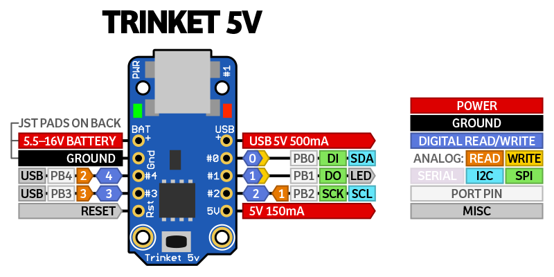
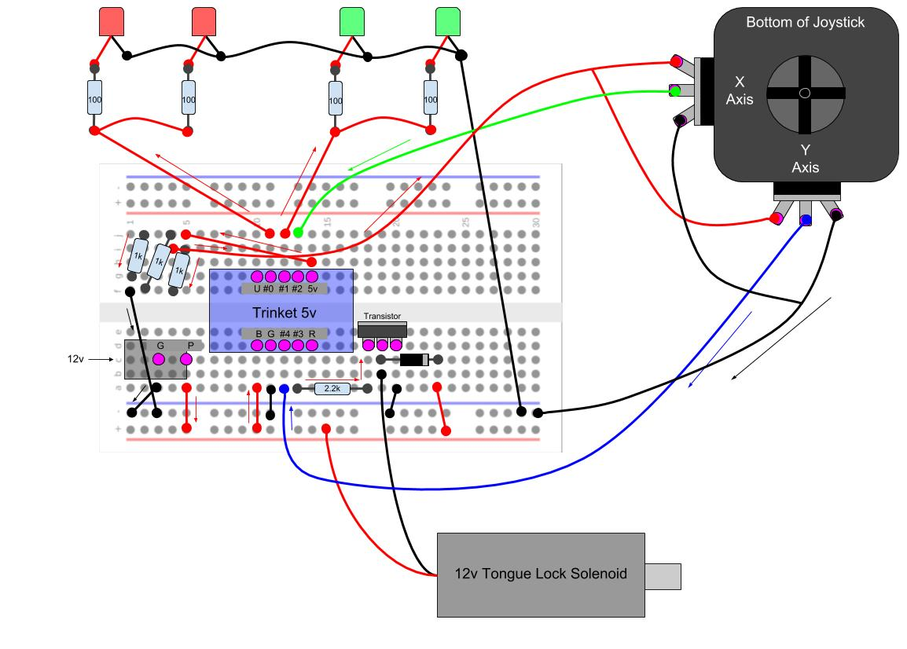

# Almanac Dispenser PDX
The Almanac dispensers are old newspaper dispensers augmented with a locking mechanism and a joystick. The contents of this repo are for the dispenser located in the **PDX** office.

# Setting up Arduino IDE

### Download
* Download the [Arduinio IDE](https://www.arduino.cc/en/Main/Software).
* Optional: Download the [Dark Theme](https://github.com/jeffThompson/DarkArduinoTheme) for it. Follow install steps on their github.

### Install Libraries
* Follow [these instruction](https://learn.adafruit.com/adafruit-arduino-ide-setup/arduino-1-dot-6-x-ide) to set up the adafruit specific libraries.
* In "Tools", set **Board** to _Adafruit Trinket (ATiny85 @ 16MHz)_.
* **Port** is based on the USB port you are using.
* Set **Programmer** to _USBtinyISP_.
* More information on setting up in general can be found [here](https://learn.adafruit.com/introducing-trinket/setting-up-with-arduino-ide) if needed.

### Updating Trinket Software
* The Trinket has multi-purpose pins, so before the bootloader can be used,
the Trinket must be removed from the circuit board.
* If the bootloader does not initiate immediately after being plugged into the computer via USB, press the black reset button on the chip.
* If you get errors when trying to update the Trinket, try a few more times. If that doesn't work, unplug it, then try again. If that doesn't work, you may need to [repair the bootloader](https://learn.adafruit.com/introducing-trinket/repairing-bootloader).
* More information on the bootloader can be found [here](https://learn.adafruit.com/introducing-trinket/starting-the-bootloader) if needed.

# Parts
(Coming soon)

# Pinouts
* You can find more detailed information on the Trinket 5v pinouts [here](https://learn.adafruit.com/introducing-trinket/pinouts).

# Schematic

